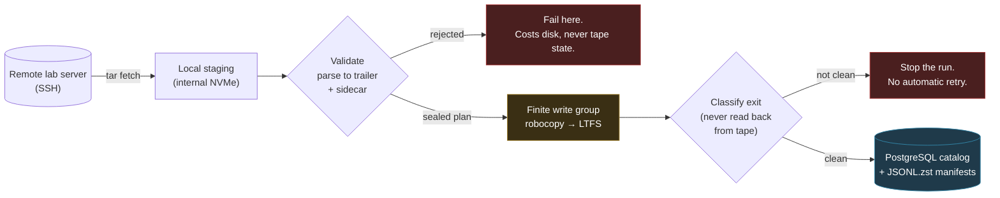

# OWC LTO-8 Archiver

**A resumable, crash-safe pipeline that moves lab-server data onto LTO-8 tape and keeps a PostgreSQL catalog of exactly what ended up where.**

Tape is unforgiving. A cartridge is linear, slow to seek, and expensive to rewrite; a drive can go read-only mid-write; `robocopy` can exit `0` on a copy that did not land. The hard part of tape archival is not writing bytes — it is being able to prove, months later, that a given file is on a given cartridge, and being able to resume a multi-day run from the exact chunk where the last one died.

This repository is the tooling built around one OWC Mercury Pro LTO-8 drive doing that job for real research data.

---

## At a glance

| | |
|---|---|
| **Scale** | ~47k lines in `src/` across 77 modules, ~36k lines of tests across 75 files |
| **Validation** | 1,737 tests pass offline; CI runs the suite on a Python matrix plus a privacy gate over full git history |
| **Persistence** | PostgreSQL 17 catalog, 19 ordered SQL migrations applied at startup |
| **Operational record** | 16 written incident post-mortems in [`docs/incidents/`](docs/incidents/) |
| **Platform** | Windows + IBM LTFS; PostgreSQL via Docker; SSH for remote sources |

## The problem

Research groups generate data faster than they can afford to keep it on spinning disk, but the data cannot simply be deleted — it has to be retrievable years later. LTO-8 tape is the standard answer at ~12 TB a cartridge. What tape does not come with is an answer to *"which cartridge is this file on, and did the write actually succeed?"*

Three properties make that genuinely difficult:

1. **A tape write is not atomic and not cheap to redo.** A run that dies 8 hours in must resume, not restart.
2. **The copy tool lies.** `robocopy` has been observed exiting `0` on writes that did not complete ([incident 009](docs/incidents/009-20260724-robocopy-exit0-lie.md)); success has to be classified, not trusted.
3. **Millions of small files destroy tape throughput.** They have to be packed into containers first — which means the per-file inventory now lives somewhere other than the filesystem.

## What the system does



**There is no code path that streams source data directly to tape.** The writer's only input is validated local staging. That single ordering constraint is what makes every failure recoverable without a person standing at the drive: a fetch or validation failure costs local disk, never tape state.

## Key engineering challenges

**Resumability across a multi-day run.** Sessions, chunks and per-file exception state are normalized in PostgreSQL, so an interrupted archive resumes from the first incomplete chunk rather than the beginning. `CHUNK_TRANSITIONS` permits only `backing → done`; an unreadable chunk status *stops the run* instead of being optimistically cleared.

**Not trusting the copy tool.** Writes are verified by classifying the copy tool's output, deliberately *not* by reading back from tape — a read-back both costs a full pass over a linear medium and can itself change drive state. Incident 009 documents the exit-code-`0` failure this defends against.

**Crash-safe artifacts.** Three versioned schemas (`plan-manifest-v1`, `tar-sidecar-v1`, `terminal-state-v1`) all publish through one protocol: write to a uniquely-named `.part` → flush and fsync → **reparse and re-validate the finished file against the sealed plan** → atomic `os.replace`. A crash leaves an orphan `.part`, never a truncated artifact a future reader would parse as complete. A catalog locator naming a `.part` is rejected in code, in `pg_scan`, *and* by a schema `CHECK`.

**Concurrency against a single physical drive.** Two processes must never address the tape at once, and the LTFS mount letter is not stable — it has moved E: → Z:. Ownership is therefore a named Windows mutex keyed on the *physical drive identity* from config, never the drive letter ([incident 006](docs/incidents/006-20260716-drive-letter-and-conf-drift.md)). It fails closed: no configured identity means no tape access.

**Keeping per-file detail off the catalog.** One PostgreSQL row per archived small file does not scale. Packed small files are inventoried in immutable `jsonl.zst` manifest segments; PostgreSQL keeps segment checksums and folder aggregates. `scripts/validate_archive_reconciliation.py` proves catalog, manifests and Storage Map agree.

## Technical decisions worth defending

| Decision | Why | Cost accepted |
|---|---|---|
| Local-first staging, never stream to tape | Makes every failure recoverable without touching tape state | Needs staging disk ≥ 3.5 chunks |
| Classify the copy exit instead of reading back | A read-back costs a full linear pass and can change drive state | Residual risk is documented, not eliminated |
| No content hashes in manifests | Hashing means reading every source byte back over SSH | Same-size-replacement risk is documented rather than papered over |
| Fail closed on ownership identity | A wrong mutex name is worse than no mutex — two hosts would think they hold it | An unconfigured clone cannot touch tape at all |
| Tape stores payload only | Nothing needed to *interpret* the archive lives only on tape | The catalog becomes critical infrastructure, hence `--backup-db` |

## Source-of-truth boundaries

Each store answers exactly one kind of question; none duplicates another. This is enforced by the layout, not by convention.

| Store | Authoritative for |
|---|---|
| `jsonl.zst` manifests | Per-file inventory of packed small files |
| PostgreSQL | Sessions, chunks, bundles, folder aggregates, tape accounting |
| Receipts + sidecars | Container evidence — SHA-256s, member counts, logical bytes |
| Tapes | Payload only |

## Tech stack

Python 3 · PostgreSQL 17 (psycopg 3, COPY bulk-load, `pg_trgm`/`btree_gin`) · IBM LTFS + `robocopy` · SSH/`tar` streaming · PySide6 (catalog inspector) · FastAPI + uvicorn (Storage Map) · Docker Compose · pytest · GitHub Actions

## Repository structure

```text
src/                 77 modules, strictly downward dependencies
  cli.py             menu entrypoint
  remote_writer.py   THE only tape-writing entry path
  scan_frontier.py   the sole production scanner
  remote_staging.py  SSH fetch, retry classification, packing
  pg_*.py            PostgreSQL layer (mixins → PgDatabaseManager facade)
storage_map/         remote disk-usage mapper, decoupled from the tape pipeline
scripts/sql/         19 ordered migrations (+ rollback variants), applied at startup
scripts/             operational tooling + the public-repo privacy gate
docs/incidents/      16 post-mortems
examples/            JSON Schemas + synthetic samples for both manifest formats
tests/               75 files
```

## Testing

```bash
pip install -r requirements.txt
python -m pytest tests/ -q
```

The offline suite needs no tape, no drive and no database. PostgreSQL suites skip unless `LTO_TEST_PG_DSN` names a disposable server — they must never be pointed at a real catalog, and `pg_test_guard` refuses a DSN it cannot prove is safe.

**Not covered by tests:** anything requiring the physical drive — LTFS mount/format/eject, real tape writes, and end-to-end restore from cartridge. Those paths are exercised by operating the system and are documented in [`docs/incidents/`](docs/incidents/).

## Limitations

- **Windows only.** The tool shells out to `vol`, `wmic`, `robocopy` and the IBM LTFS executables.
- **One drive.** Ownership is a single mutex around a single physical drive; there is no drive pool.
- **Vendor tooling is not bundled.** IBM LTFS SDE, ITDT and the ATTO HBA driver are proprietary and must be obtained from the vendors.
- **No content hashes for fetched files** — see the decision table above.
- **The catalog is critical.** Tape holds payload only, so losing PostgreSQL without a dump means losing the index. Back it up (`python run.py --backup-db`).

## Future improvements

- Read-back verification as an opt-in mode for high-value cartridges, accepting the extra pass.
- Content hashing at the remote end so the same-size-replacement risk closes without a second SSH read.
- A drive pool, which would turn the single ownership mutex into a lease per drive.

---
## Documentation

- [Documentation map](docs/README.md) — task routing and source-of-truth rules
  for engineers and LLMs.
- [Repository and safety guidance](AGENTS.md) — read before changing code or
  operating a live tape run.
- [Architecture](docs/architecture.md) — the canonical local-first pipeline
  (remote source → local staging → validation → tape → verify → commit) and
  the source-of-truth boundaries.
- [Operations runbook](docs/operations.md) and
  [tape/archive state](docs/tape-and-archive-state.md).
- [Incident index](docs/incidents/README.md) — read before recovery or
  troubleshooting.

## Features

- **Smart packing** — small files (under a configurable threshold) are bundled into ZIP archives to minimize tape fragmentation; large files are copied directly
- **PostgreSQL catalog** — every archived file is recorded with its original path, source host, tape label, backup date, and ZIP container (if packed)
- **Restore** — search by filename/wildcard, date range, original directory, or full backup session; restore individual files or entire sets
- **Tape management** — format, register, check, and inspect tapes via IBM LTFS command-line tools
- **Multi-tape support** — tracks multiple tapes; prompts you to swap tapes during restore when needed
- **Remote archive** — fetch files from a remote SSH host into local staging, pack them, and stream them to LTO
- **Database Inspector GUI** — standalone PySide6 app for lazy browsing, searching, and managing the tape/file index without touching the CLI
- **Storage Map** - run `python storage_map/run_app.py --open-chrome` for the single local web app with scan, status, refresh, tape coverage, and HTML/PDF export

## Manifest formats

The per-file inventory and the container receipts are the archive's
source-of-truth artifacts, and their formats are documented as JSON Schema in
[`examples/`](examples/) alongside synthetic samples. Real manifests and
receipts enumerate actual file names and source paths, so they are operational
data and stay out of this repository.

Before pushing, `python scripts/check_public_repo.py` fails loudly if a
database, dump, log, real manifest, credential or infrastructure identity has
become tracked; CI runs the same gate plus the test suite.

## Requirements

- Windows (uses `vol`, `wmic`, and IBM LTFS executables)
- Python 3.11+ (CI proves 3.11, 3.12 and 3.13 on Windows; 3.9 and 3.10 fail)
- [IBM LTFS SDE](https://www.ibm.com/support/pages/ibm-linear-tape-file-system-ltfs) installed to `C:\Program Files\IBM\LTFS\`
- OWC Mercury Pro LTO-8 (or compatible LTFS-formatted LTO drive)
- OpenSSH client tools for remote archive mode
- PostgreSQL 17, either local via `docker compose up -d db` or an existing server
- `PySide6` (required only for the DB Inspector GUI): `pip install PySide6`

These installers are **not** bundled in this repository (they are proprietary). Download
them from the vendors and, if you wish, keep them in a local `Framework & Drivers\`
folder (gitignored):

- IBM LTFS SDE — from IBM support (link above)
- IBM ITDT (IBM Tape Diagnostic Tool Standard Edition) — `install_itdt_se_WindowsX86_64_9.6.3.20250314.exe`
- ThunderLink SH-3128 HBA driver + release notes — from ATTO
- Visual C++ redistributable and .NET Framework 4.0 — from Microsoft (LTFS dependencies)

## Setup

1. Install IBM LTFS SDE and the HBA driver (download links above).
2. Format a tape and mount it so it appears as a drive letter (e.g. `E:\`).
3. Copy `config.example.ini` to `config.ini` and edit it (your `config.ini` is
   gitignored). For remote archive, also copy `.env.example` to `.env` and set
   `PGPASSWORD` and `REMOTE_PASSWORD` there. Key fields:

```ini
[PATHS]
source_dir  = C:\path\to\your\source\files
staging_dir = C:\path\to\staging\area
restore_dir = C:\path\to\restored\files

[DATABASE]
host = localhost
port = 5432
dbname = lto_archive
user = lto
sslmode = prefer

[HARDWARE]
lto_drive     = E:\\
ibm_eject_cmd = C:\Program Files\IBM\LTFS\LtfsCmdEject.exe

[SETTINGS]
zip_threshold_mb = 100   ; files smaller than this are packed into ZIPs
max_zip_size_gb  = 100   ; maximum size per ZIP bundle

[REMOTE]
remote_host = example.host.local
remote_user = archive-user
remote_path = /path/to/remote/source
staging_fill_pct = 0.80
```

## Usage

```
# CLI (no extra dependencies)
python run.py

# Create a PostgreSQL catalog backup
python run.py --backup-db

# Database Inspector GUI (requires PySide6)
python inspect_db.py

# Storage Map web app (opens Chrome when configured)
python storage_map/run_app.py --open-chrome
```

### Main Menu

| Option | Action |
|--------|--------|
| 1 | **Archive** — analyze source folder and back up to tape |
| 2 | **Retrieve** — search DB and restore files from tape |
| 3 | **Tape Maintenance** — format, register, check, or inspect tapes |
| 4 | **List Registered Tapes** — show all tapes with used/total space |
| 5 | **Open config.ini** |
| 6 | **Remote Archive** — fetch from a remote host and back up to LTO |
| 7 | **Database Management** — edit or delete tape and file records |
| 8 | **Backup Summary** — ensure `backup_logs/SUMMARY.csv` exists |
| 9 | **Database Backup** — dump the PostgreSQL catalog to `db_backups/` |
| 0 | Exit |

### Archive Workflow

1. The analyzer scans `source_dir`, reports file-size distribution, and builds a local multi-tape allocation plan.
2. Files under `zip_threshold_mb` are packed into session-specific ZIP bundles; large files are staged as loose files.
3. The app creates a resumable local session in PostgreSQL. If a previous local session is active, you can resume it or abandon it.
4. Before each chunk is written, the mounted tape label is detected and assigned to that chunk.
5. New blank tapes are registered automatically. Registered non-empty LTFS tapes can also be used for append backups when both the LTFS free-space check and the database capacity check show enough room.
6. Robocopy streams the staged batch to tape with `/J` unbuffered I/O, retry settings, a simple active heartbeat, and tuned priority/affinity when available.
7. After copying, file records are written to PostgreSQL, tape used-space is reconciled, and the tape is ejected automatically via `LtfsCmdEject.exe`.
8. A compact aggregate CSV row is appended to `backup_logs/SUMMARY.csv`; per-file manifests are not written to logs.

If a write is interrupted, re-run option 1 and choose **Resume from first incomplete chunk**. The app skips records that are already indexed for the same local session/chunk/tape.

### Remote Archive Workflow

Option 6 scans `remote_path` over SSH, splits the remote file list into staging-sized chunks, fetches each chunk to local staging, packs it, and writes it to the selected tape. Remote sessions are resumable; if a fetch or tape write fails, re-run option 6 and resume the active session.

The remote pipeline can prefetch chunks ahead of the tape writer so the drive keeps streaming while network fetch and packing continue in the background. Tune `chunk_cap_gb`, `prefetch_chunks_ahead`, `staging_max_gb`, `robocopy_priority`, `cpu_affinity`, `ssh_cipher`, and `use_mbuffer` in the `[PERFORMANCE]` section.

### Retrieve Workflow

Choose a search mode:

| Option | Search |
|--------|--------|
| 1 | Filename / wildcard (e.g. `*.mov`, `IMG_*`) |
| 2 | Date range (backed-up from / to, YYYY-MM-DD) |
| 3 | Both filename and date range |
| 4 | Restore full directory — partial path match against original paths |
| 5 | Restore full backup session — select from a dated session list |
| 6 | Restore a complete directory from bundle ZIP contents |
| 7 | Search/restore pruned small files from permanent local manifests |

Results are displayed in bounded pages showing file ID, filename, size, backup date, source host, and tape label.

- Enter a **file ID** to restore a single file.
- Enter **N** / **P** to move between result pages.
- Enter **ALL** to restore every result; large result sets require typing `RESTORE ALL` to confirm.
- Enter **0** to cancel.

**Tape handling** — before each restore the script checks the mounted tape label. If the wrong tape is inserted you'll be prompted to swap it before copying begins.

**Packed files (ZIP bundles)** — files that were archived via AUTO-PILOT are stored inside `Bundle_NNN.zip` containers on tape. The restore process:
1. Copies the ZIP from tape to the staging directory via robocopy.
2. Extracts the target file(s) from the ZIP to the restore directory.
3. Deletes the staging ZIP automatically.

When restoring multiple files from the same ZIP bundle in one page, the bundle is copied from tape only once.

### Tape Maintenance Sub-menu

| Option | IBM LTFS tool |
|--------|---------------|
| Format tape | `LtfsCmdFormat.exe` — **erases all data** |
| Register tape manually | DB only (for tapes already formatted) |
| List drives | `wmic logicaldisk` |
| Check tape | `LtfsCmdCheck.exe` — repair filesystem errors |
| Tape drives info | `LtfsCmdDrives.exe` — list connected drives |
| Eject tape | `LtfsCmdEject.exe` — safely eject without archiving |

## Database Inspector GUI

`inspect_db.py` launches a PySide6 GUI, implemented in `src/db_inspector_qt.py`, for lazy browsing, trigram search, and management of the PostgreSQL archive catalog without using the CLI.

```
python inspect_db.py
```

**Tapes tab** — lists all registered tapes with capacity bars and file counts. Select a tape to enable:
- **Rename** — update the volume label (cascades to all file records)
- **Set Capacity** — manually set the tape's total capacity in GB
- **Recalculate Used** — recompute used space from the files_index
- **Wipe File Records** — delete all file records for the tape (tape entry kept); type the label to confirm
- **Delete Tape** — permanently remove the tape and all its file records; type the label to confirm

**Files tab** — lazy tape/directory browser backed by PostgreSQL catalog indexes. Select one or more rows to **Delete Selected** or double-click a row to open a **View Details** panel showing all fields, including the source host.

**Search tab** — PostgreSQL trigram substring search over catalog names and original paths, with bounded result pages and source-host filtering.

**Manage tab** — tape and session management actions, including rename, capacity, recalculation, wipe/delete, and unused session-data cleanup.

## PostgreSQL Setup

```
docker compose up -d db
```

PostgreSQL artifacts:

- `docker-compose.yml` — Postgres 17 dev service with bulk-load tuning
- `scripts/pg_init/00_extensions.sql` — `pg_trgm` and `btree_gin`
- `scripts/sql/001_postgres_schema.sql` — normalized non-partitioned schema
- `scripts/sql/002_postgres_indexes.sql` — unique record key, browse B-trees,
  and trigram GIN search indexes
- `src/pg_bulk.py` — reusable psycopg 3 COPY/staging upsert helper

## Database Schema

PostgreSQL contains the permanent archive catalog plus normalized session
tables. Local credentials live in `.env`, which remains gitignored.

### Database Backups

Use menu option 9 or run `python run.py --backup-db` to create a PostgreSQL
custom-format dump in `db_backups/`. The helper uses the local Docker container
when available, otherwise it falls back to `pg_dump` from PostgreSQL client
tools on PATH.

**`tapes`** — one row per tape
- `volume_label`, `date_formatted`, `total_capacity`, `used_space`

**`files_index`** — one row per indexed large/current file; validated rows
smaller than 10 MiB may be pruned after permanent local export
- `original_path`, `file_size_bytes`, `source_host`, `tape_label`
- `is_packed`, `stored_path`, `local_session_id`, `local_chunk_index`
- `record_key`, `archive_run_id`, `directory_id`, `catalog_name`,
  `catalog_backup_date`
- ZIP bundle and run metadata are normalized through `archive_bundles` and
  `archive_runs`.

**Local small-file archive** — immutable `jsonl.zst` segments under the
configured `[LOCAL_MANIFEST_ARCHIVE] root`. After a validated export is
pruned, these manifests are the per-file source of truth for packed small
files: PostgreSQL retains segment checksums and direct/recursive folder count
and byte aggregates, but no per-file snapshot rows. See
`docs/local_small_file_manifest_runbook.md`, and run
`python scripts/validate_archive_reconciliation.py` to prove the catalog,
manifests, and Storage Map agree.

The CLI also creates session tables for resumable work:

- **`local_sessions` / `local_chunks_manifest`** — local multi-tape plans and per-chunk status
- **`remote_sessions` / `remote_snapshots` / `remote_plans` / `remote_chunks` / `remote_file_state`** — normalized remote archive sessions, reusable source snapshots, plans, and per-file exception state

## Important

**Run the script as Administrator for best tape throughput.** When elevated, the app temporarily adds a Windows Defender process exclusion for `robocopy.exe` during archive and retrieval operations, then removes only the exclusion it added. It does not add drive, staging-directory, or restore-directory path exclusions.

## License

Copyright © 2026 Raz Ben Aharon.

Released under the [MIT License](LICENSE). You are free to use, copy, modify, and distribute this software, including for commercial purposes, provided the copyright notice and license text are retained.
